# 💰 FinBot – AI-Powered Personal Finance Assistant

## 📌 Project Overview

FinBot is an intelligent Personal Finance Assistant developed using Google Dialogflow. The chatbot helps users understand key financial concepts, perform financial calculations, receive personalized financial guidance, and make informed decisions regarding loans, investments, budgeting, insurance, taxation, and wealth management.

The project leverages Natural Language Processing (NLP) to understand user queries and provide relevant financial recommendations through multiple specialized intents.

---

## 🎯 Objectives

- Provide instant financial guidance through conversational AI.
- Simplify complex financial calculations.
- Improve financial literacy among users.
- Assist in investment, taxation, budgeting, and loan-related decisions.
- Deliver an interactive and user-friendly financial advisory experience.

---

# 🚀 Key Features

### 📈 Investment Analysis
- ROI Calculator
- NPV Calculator
- IRR Calculator
- Break-Even Analysis

### 💳 Credit & Loan Advisory
- Loan Advisor
- EMI Calculator
- Credit Score Advisor

### 💰 Personal Finance Management
- Budgeting Advisor
- Tax Saving Advisor
- Insurance Advisor

### 📊 Financial Ratio Analysis
- Current Ratio Calculator
- Debt-to-Equity Ratio Analysis

### 🤖 Conversational Features
- Welcome Intent
- Finance Communication Intent
- Fallback Intent Handling
- Personalized Financial Responses

---

# 📂 Repository Structure

```text
FinBot/
│
├── README.md
│
├── Default Welcome Intent.png.png
├── Default Fallback Intent.png.png
│
├── Wecome_Finance.png.png
├── Kommunicate FinBot.png.png
│
├── Budgeting_Advise.png.png
├── Credit_Score_Advisor.png.png
├── Insurance_advisor.png.png
├── Investment_Advisor.png.png
├── Loan_Advisor.png.png
├── Tax_Saving_Advisor.png.png
│
├── EMI_Calculator.png.png
├── ROI_Intent.png.png
├── NPV_Intent.png.png
├── IRR_Intent.png.png
├── Break_Even_Intent.png.png
│
├── Current_Ratio_Intent.png.png
└── Debt_Equity_intent.png.png
```

---

# 🛠️ Technologies Used

| Technology | Purpose |
|------------|----------|
| Dialogflow ES | Conversational AI Development |
| NLP (Natural Language Processing) | Intent Recognition |
| Google Cloud Platform | Dialogflow Deployment |
| Kommunicate | Chatbot Integration |
| GitHub | Version Control & Documentation |
| JSON | Intent Configuration |
| Finance Domain Knowledge | Financial Advisory Logic |

---

# 🏗️ System Workflow

```text
User Query
      │
      ▼
Dialogflow Intent Detection
      │
      ▼
Relevant Financial Intent
      │
      ▼
Financial Logic / Response
      │
      ▼
User Receives Recommendation
```

---

# 📸 Project Screenshots

---

## 1️⃣ Welcome Finance Intent

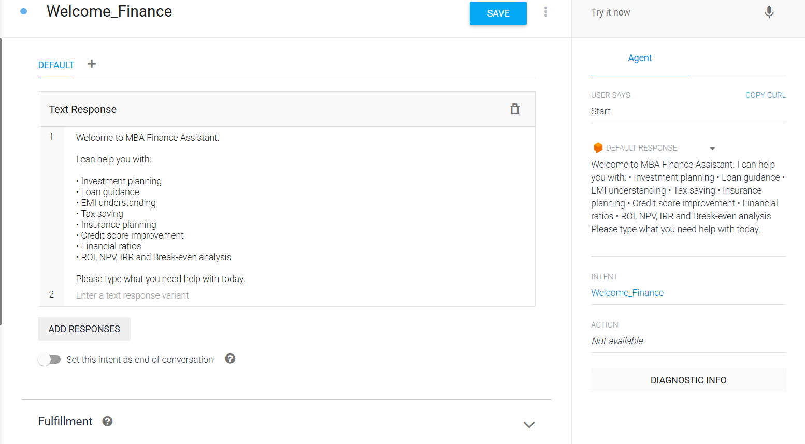

---

## 2️⃣ Default Welcome Intent


---

## 3️⃣ Default Fallback Intent


---

## 4️⃣ Kommunicate Integration


---

# 💵 Financial Advisory Intents

---

## Budgeting Advisor

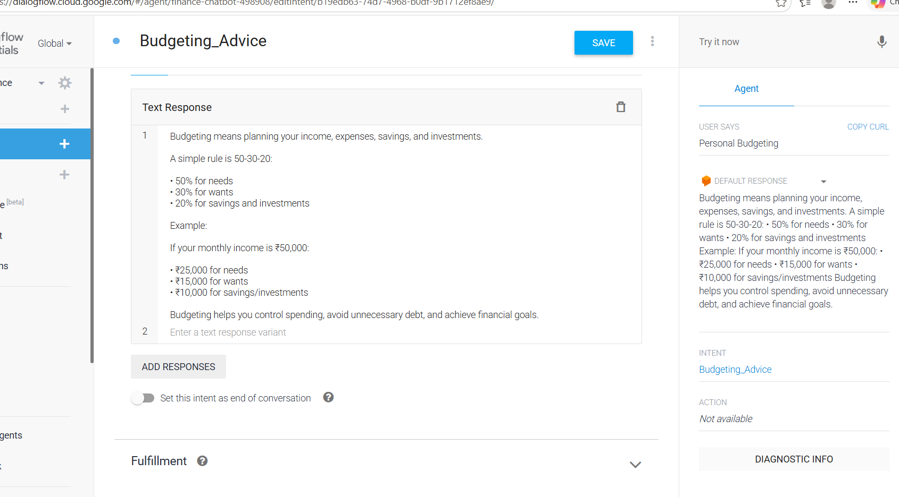

### Purpose
Provides budgeting recommendations and expense management guidance.

---

## Credit Score Advisor

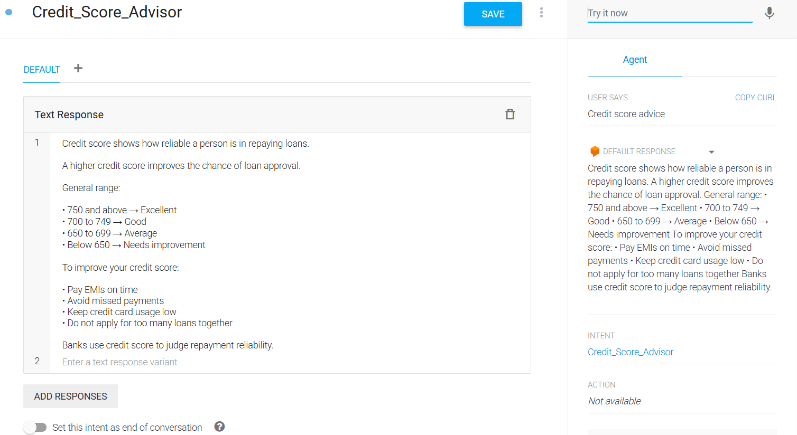

### Purpose
Offers suggestions for improving and maintaining healthy credit scores.

---

## Insurance Advisor

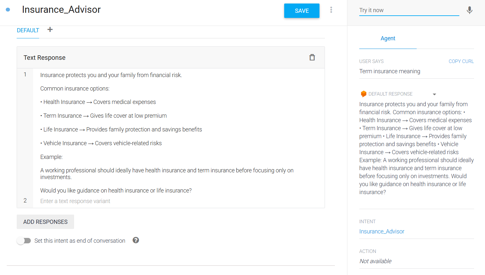

### Purpose
Helps users understand insurance requirements and policy considerations.

---

## Investment Advisor

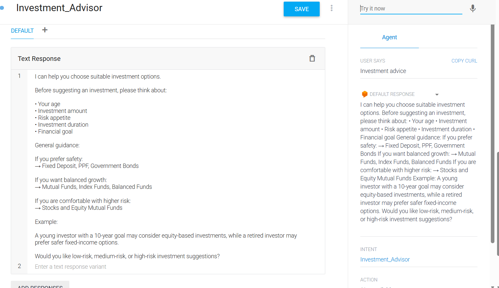

### Purpose
Provides investment-related guidance and financial planning support.

---

## Loan Advisor

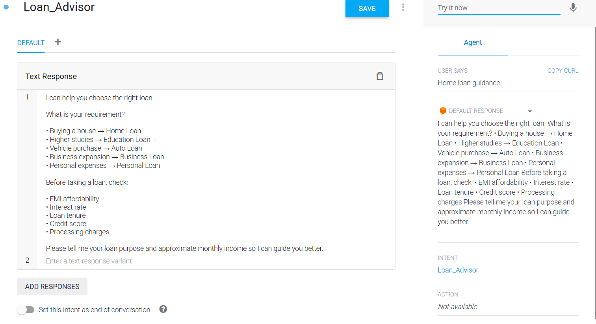

### Purpose
Assists users in evaluating loan options and borrowing decisions.

---

## Tax Saving Advisor

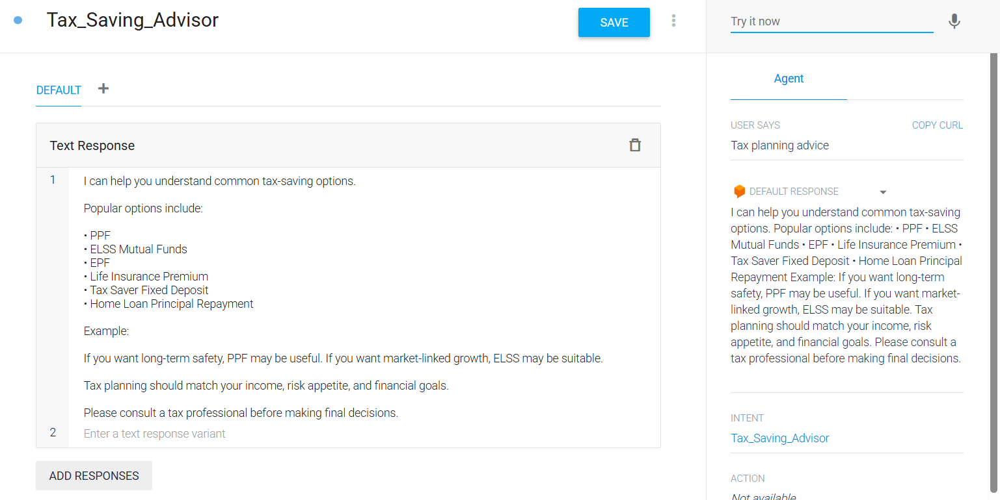

### Purpose
Suggests tax-saving opportunities and financial planning strategies.

---

# 📊 Financial Calculation Intents

---

## EMI Calculator

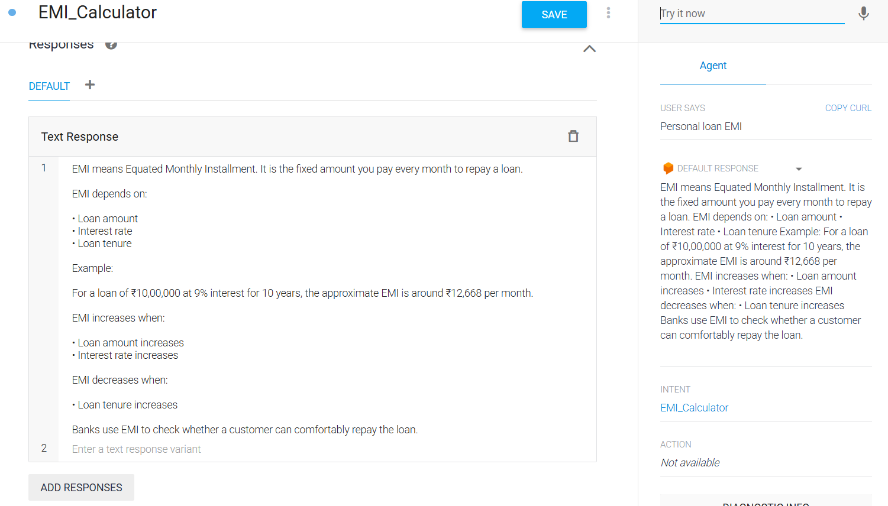

### Purpose
Calculates monthly loan repayment obligations.

---

## ROI Calculator

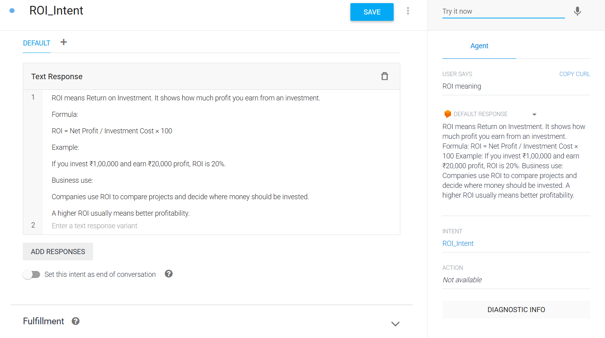

### Purpose
Calculates Return on Investment for evaluating investment performance.

---

## NPV Calculator

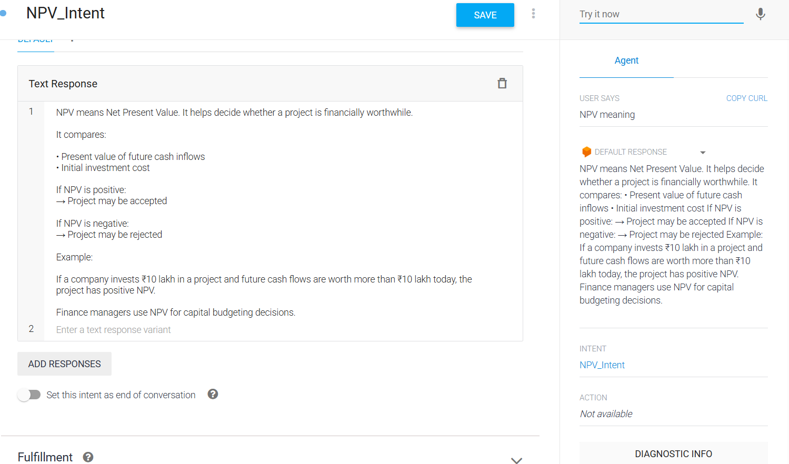

### Purpose
Computes Net Present Value for capital budgeting decisions.

---

## IRR Calculator

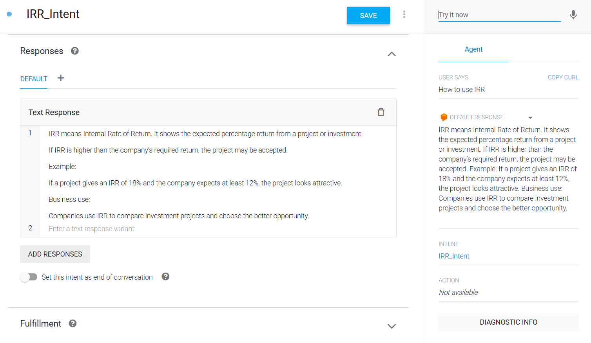

### Purpose
Calculates Internal Rate of Return for investment evaluation.

---

## Break-Even Analysis

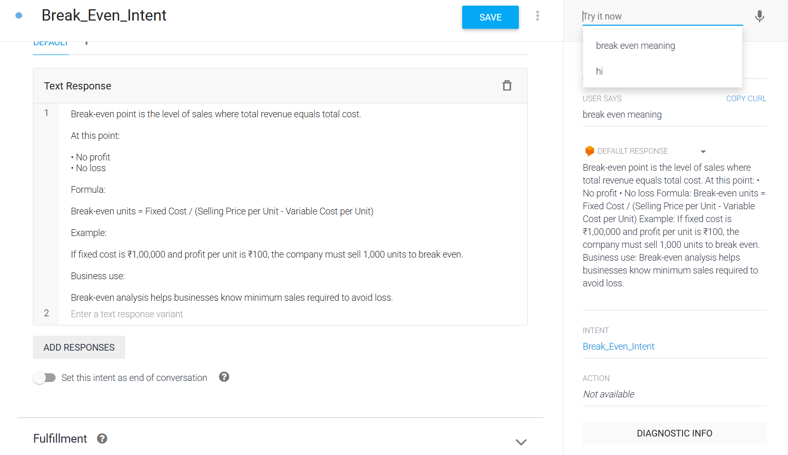

### Purpose
Determines the point where revenue equals total cost.

---

# 📈 Financial Ratio Analysis

---

## Current Ratio Intent

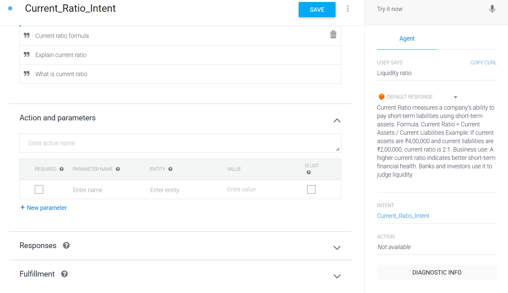

### Purpose
Evaluates short-term liquidity and ability to meet current obligations.

---

## Debt-to-Equity Ratio Intent

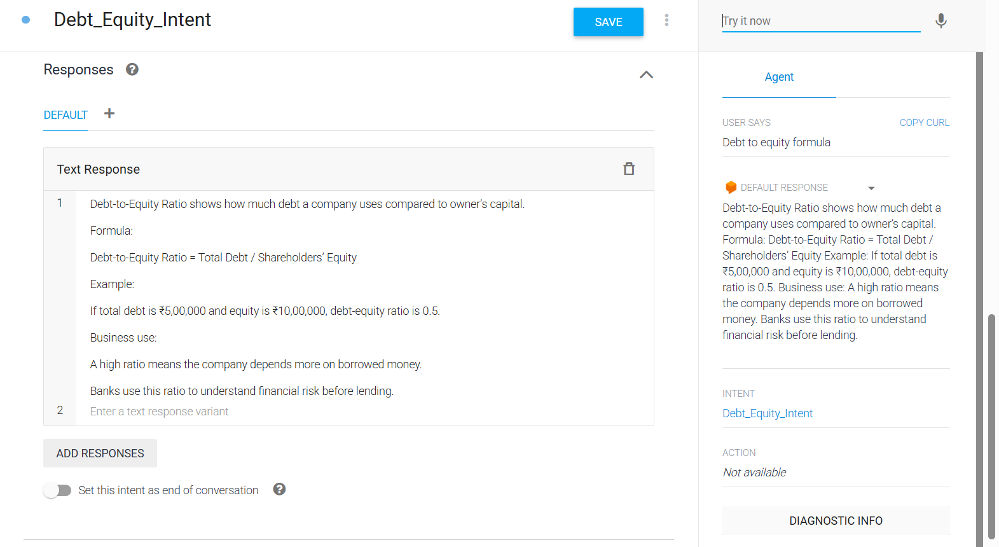

### Purpose
Measures financial leverage and capital structure.

---

# 🤖 Sample User Interactions

### Example 1

**User:** Calculate EMI for ₹5,00,000 at 10% interest for 5 years.

**FinBot:** Based on the provided inputs, your estimated EMI is ₹10,624 per month.

---

### Example 2

**User:** What is ROI?

**FinBot:** ROI (Return on Investment) measures the profitability of an investment relative to its cost.

---

### Example 3

**User:** Suggest ways to save tax.

**FinBot:** You may consider investments under applicable tax-saving instruments and deductions as per regulations.

---

# 🌟 Project Highlights

✅ 15+ Financial Intents

✅ Investment Analysis Tools

✅ Financial Ratio Calculators

✅ Loan & Credit Advisory

✅ Budgeting Guidance

✅ Insurance Recommendations

✅ Tax Planning Assistance

✅ Integrated with Kommunicate

✅ Dialogflow-Based NLP Engine

---

# 📚 Learning Outcomes

This project demonstrates:

- Conversational AI Development
- Intent Classification
- NLP-based Query Processing
- Financial Advisory System Design
- Dialogflow Integration
- Chatbot Deployment Workflow
- Financial Decision Support Systems

---

# 🔮 Future Enhancements

- Integration with Real-Time Financial APIs
- Portfolio Tracking
- Mutual Fund Recommendations
- Stock Market Insights
- User Authentication
- Personalized Financial Dashboard
- Voice-Based Financial Assistant

---

# 📌 Conclusion

FinBot showcases the application of Conversational AI in personal finance management. By combining Dialogflow's NLP capabilities with financial advisory logic, the chatbot delivers an interactive platform that assists users in budgeting, investing, loan planning, tax saving, and financial decision-making. The project highlights how AI-powered assistants can simplify financial literacy and improve access to financial guidance.

---

### 👨‍💻 Developed Using
Google Dialogflow • Google Cloud Platform • Kommunicate • GitHub

